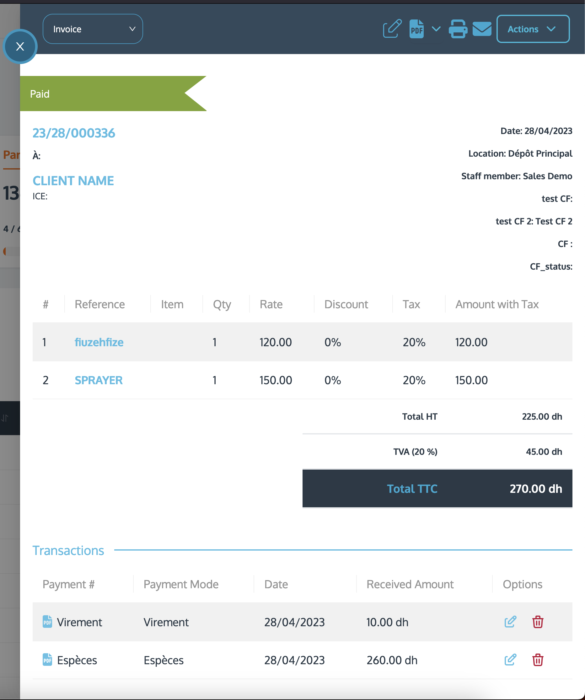

# Frontend Coding challenge

## Context

ERP users love to have their UI as much customizable as possible. They want to be able to change the color of the buttons, the font size, the background color, etc. They also want to be able to save their preferences and share them with their colleagues.
The objective of this challenge is to create an implementation of a highly customizable UI component which is the display drawer of a relation (by relation we mean an invoice, estimate, client etc..)

## Requirements

- The component should be a drawer that can be opened and closed
- The component should be customizable from the structured configuration object (that you'll find in the `src/app/page.tsx` file)
- We're more interested in the code quality than the UI design but feel free to make it look nice, it's always a plus (we will provide you with examples on how it should look like)

## What you'll find in this repository
- A basic next.js app with a single page containing a datatable and the drawer component to implement
- Type definitions for the relations and the configuration object
- An api endpoint to fetch a single invoice `/api/invoices/{id}`
- A basic skeleton for the drawer component and some guiding paths in the code (feel free to implement it with your own approach, in fact, we encourage you to do so)
- In case you follow our approach, you can look for `// TODO:` in the code to find the missing parts

## Example
